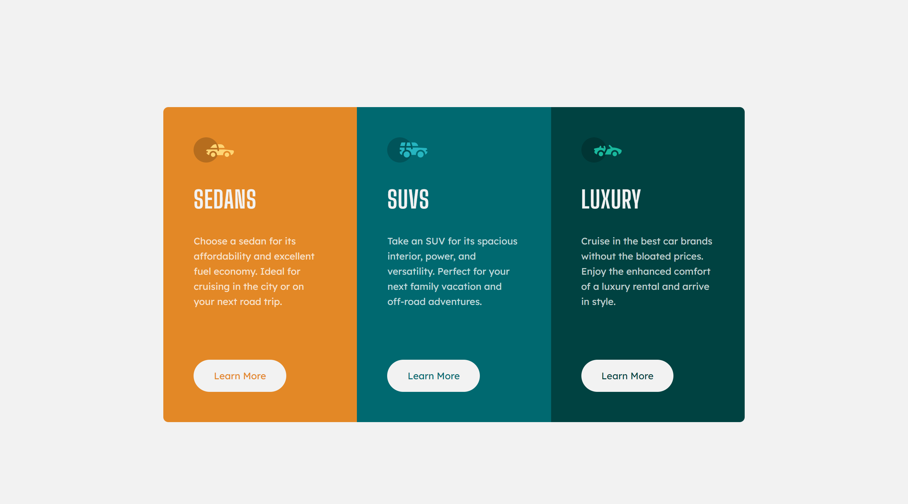

# 💻 Frontend Mentor - 3-column preview card component

### Olá! 🌞

### Guia de conteúdo:

- [Visão geral](#visao-geral)
- [Processo](#processo)
  - [Tecnologias usadas](#tecnologias)
  - [O que aprendi](#o-que-aprendi)

### Visão geral
Desafio simples que pede a construção de um card de três colunas em bloco em telas mobile e em linha para telas desktop.

### Processo
Estrutura HTML simples com uma tag "article" para conter as três colunas do card. Para estilizar, novamente usei SASS (.scss) para praticar o que aprendi anteriormente em um curso.

### Tecnologias
- HTML
- SASS (.scss)

### O que aprendi
Desafio para prática, Tudo o que utilizei já era do meu conhecimento.

### Meus perfis
   - [Front-end Mentor](https://www.frontendmentor.io/profile/instmi)
   - [Twitter](https://twitter.com/instmi_studies)
   - [LinkedIn](https://www.linkedin.com/in/milenaoandrade/)